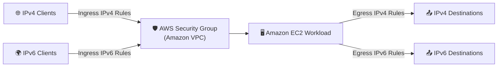
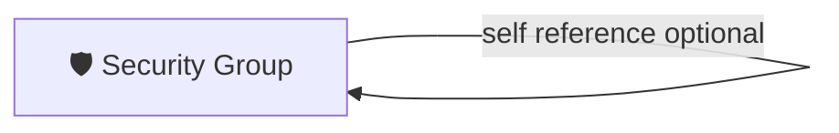

# Terraform AWS Security Group Module 🛡️

Terraform module to create an AWS Security Group with support for:
- IPv4 rules (`cidr_ipv4`) 🌐
- IPv6 rules (`cidr_ipv6`) 🌍
- Optional self-referencing rule (`enable_self_reference`) 🔁

## Architecture Diagrams

### High-level Rule Flow (AWS icon style + emojis)



### Self-Referencing Rule Path 🔁



## Usage

```hcl
module "app_sg" {
  source = "."

  name   = "app-sg"
  vpc_id = "vpc-1234abcd"

  description = "Application security group"

  ingress_ipv4_rules = [
    {
      description = "Allow HTTPS from internet"
      from_port   = 443
      to_port     = 443
      protocol    = "tcp"
      cidr_ipv4   = "0.0.0.0/0"
    }
  ]

  ingress_ipv6_rules = [
    {
      description = "Allow HTTPS from IPv6 internet"
      from_port   = 443
      to_port     = 443
      protocol    = "tcp"
      cidr_ipv6   = "::/0"
    }
  ]

  egress_ipv4_rules = [
    {
      description = "Allow all outbound IPv4"
      from_port   = 0
      to_port     = 0
      protocol    = "-1"
      cidr_ipv4   = "0.0.0.0/0"
    }
  ]

  egress_ipv6_rules = [
    {
      description = "Allow all outbound IPv6"
      from_port   = 0
      to_port     = 0
      protocol    = "-1"
      cidr_ipv6   = "::/0"
    }
  ]

  enable_self_reference      = true
  self_reference_type        = "ingress"
  self_reference_protocol    = "tcp"
  self_reference_from_port   = 0
  self_reference_to_port     = 65535
  self_reference_description = "Allow workload-to-workload traffic in same SG"

  tags = {
    Name        = "app-sg"
    Environment = "dev"
  }
}
```

## Mandatory Inputs

| Name | Type | Description |
|------|------|-------------|
| `name` | `string` | Name of the security group. |
| `vpc_id` | `string` | VPC ID where the security group will be created. |

## Optional Inputs

| Name | Type | Default | Description |
|------|------|---------|-------------|
| `description` | `string` | `"Managed by Terraform"` | Description of the security group. |
| `revoke_rules_on_delete` | `bool` | `true` | Revoke rules before deleting the security group. |
| `tags` | `map(string)` | `{}` | Tags to apply to the security group. |
| `ingress_ipv4_rules` | `list(object)` | `[]` | Ingress rules using `cidr_ipv4`. |
| `ingress_ipv6_rules` | `list(object)` | `[]` | Ingress rules using `cidr_ipv6`. |
| `egress_ipv4_rules` | `list(object)` | `[]` | Egress rules using `cidr_ipv4`. |
| `egress_ipv6_rules` | `list(object)` | `[]` | Egress rules using `cidr_ipv6`. |
| `enable_self_reference` | `bool` | `false` | Enable/disable self-referencing rule. |
| `self_reference_type` | `string` | `"ingress"` | Self-rule type: `ingress` or `egress`. |
| `self_reference_description` | `string` | `"Self reference rule"` | Description of self-rule. |
| `self_reference_protocol` | `string` | `"-1"` | Protocol for self-rule (`-1`, `tcp`, `udp`, `icmp`, `icmpv6`, or number). |
| `self_reference_from_port` | `number` | `0` | Start port for self-rule. |
| `self_reference_to_port` | `number` | `0` | End port for self-rule. |

### Rule Object Schemas

`ingress_ipv4_rules` and `egress_ipv4_rules` object schema:

```hcl
{
  description = optional(string, "")
  from_port   = number
  to_port     = number
  protocol    = string
  cidr_ipv4   = string
}
```

`ingress_ipv6_rules` and `egress_ipv6_rules` object schema:

```hcl
{
  description = optional(string, "")
  from_port   = number
  to_port     = number
  protocol    = string
  cidr_ipv6   = string
}
```

## Outputs

| Name | Description |
|------|-------------|
| `security_group_id` | ID of the created security group. |
| `security_group_arn` | ARN of the created security group. |
| `security_group_name` | Name of the created security group. |
| `security_group_vpc_id` | VPC ID where the security group is created. |
| `ingress_ipv4_rule_ids` | Map of ingress IPv4 rule IDs keyed by input index. |
| `ingress_ipv6_rule_ids` | Map of ingress IPv6 rule IDs keyed by input index. |
| `egress_ipv4_rule_ids` | Map of egress IPv4 rule IDs keyed by input index. |
| `egress_ipv6_rule_ids` | Map of egress IPv6 rule IDs keyed by input index. |
| `self_reference_rule_id` | ID of self-reference rule if enabled, else `null`. |

## Validation Highlights ✅

- All CIDR inputs are validated using Terraform CIDR functions.
- Protocol values are validated (`-1`, `tcp`, `udp`, `icmp`, `icmpv6`, numeric protocol).
- Port ranges are validated (`0..65535`, and `from_port <= to_port` where applicable).
- For protocol `-1`, ports must be `0` and `0`.
