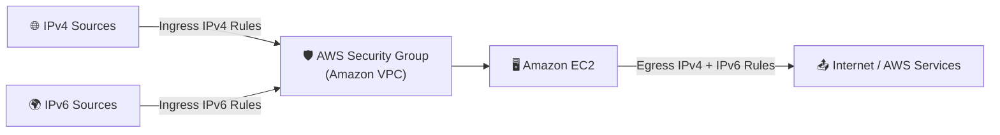
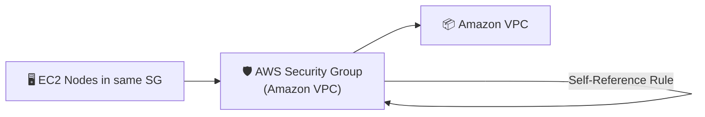

# Examples for `terraform-aws-sg-module` 🧩

This folder contains runnable examples showing how to consume the child module for:
- ✅ Self-referencing rule enabled
- ✅ Self-referencing rule disabled

## Example Structure

- `self-reference-enabled/` → creates SG with `enable_self_reference = true`
- `self-reference-disabled/` → creates SG with `enable_self_reference = false`

## Architecture Diagrams

### 1) Self-Referencing Disabled 🚫🔁



### 2) Self-Referencing Enabled ✅🔁



## How to Run

### Self-Reference Enabled

```bash
cd examples/self-reference-enabled
terraform init
terraform plan -var='vpc_id=vpc-1234abcd'
terraform apply -var='vpc_id=vpc-1234abcd'
```

### Self-Reference Disabled

```bash
cd examples/self-reference-disabled
terraform init
terraform plan -var='vpc_id=vpc-1234abcd'
terraform apply -var='vpc_id=vpc-1234abcd'
```

## Mandatory Inputs

These inputs are required in both example folders.

| Name | Type | Description |
|------|------|-------------|
| `vpc_id` | `string` | VPC ID where the security group will be created. |

## Optional Inputs

These optional inputs are available in both example folders.

| Name | Type | Default | Description |
|------|------|---------|-------------|
| `aws_region` | `string` | `"us-east-1"` | AWS region for provider configuration. |

## Outputs

Both examples return the same outputs.

| Name | Description |
|------|-------------|
| `security_group_id` | ID of the security group created by the child module. |
| `self_reference_rule_id` | Self-reference rule ID (`null` when self-reference is disabled). |

## Child Module Inputs Summary

The child module at `../` supports:
- IPv4 and IPv6 ingress/egress rule objects
- Optional self-referencing rule with `enable_self_reference`
- Validated rule protocol, port ranges, and CIDR formats

For the complete list, see the root module docs in `README.md`.
